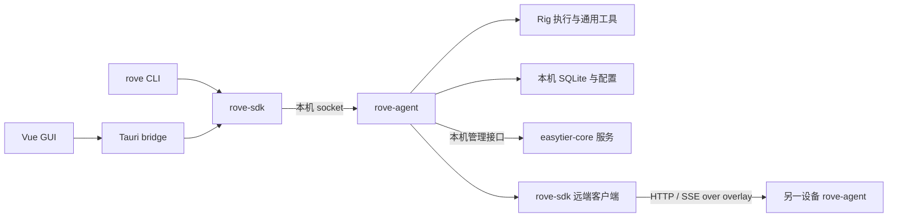
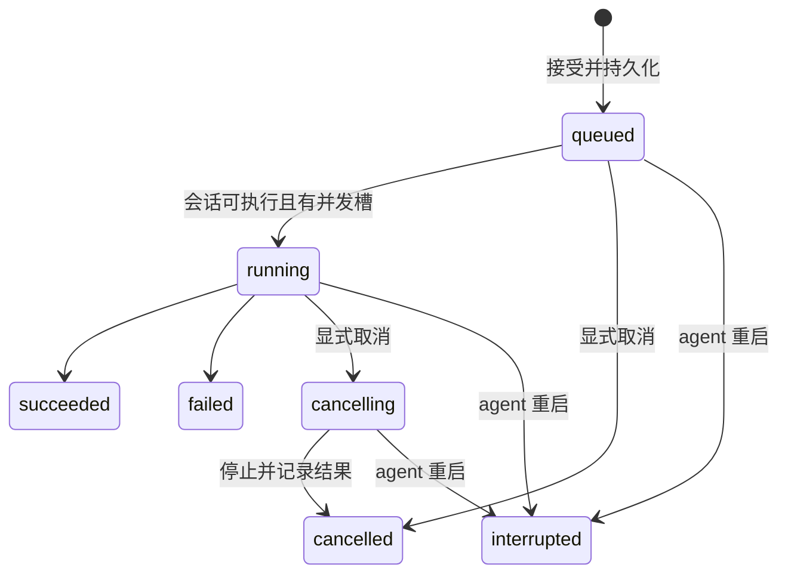
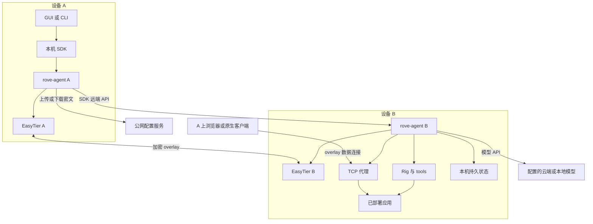
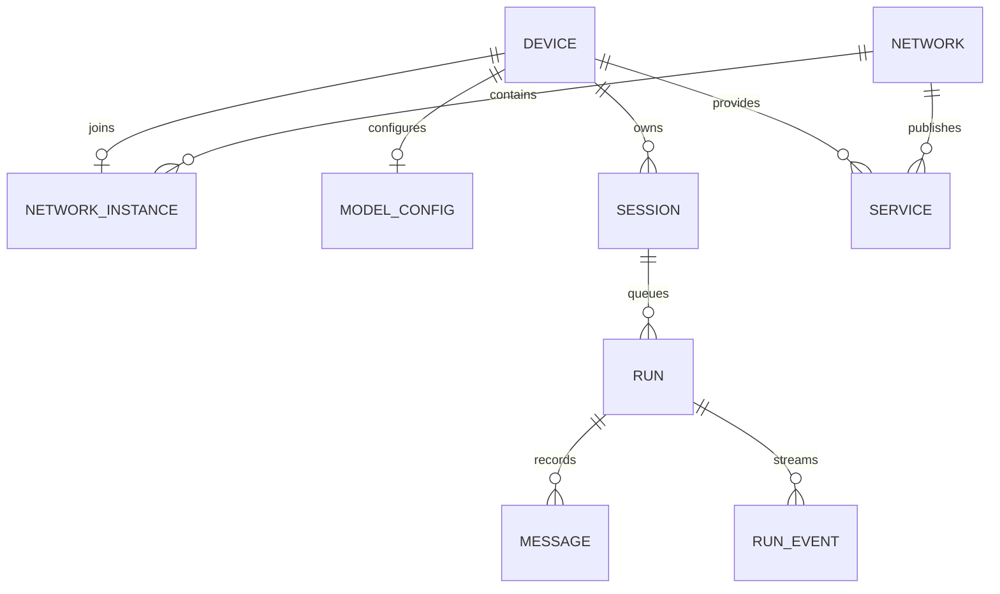
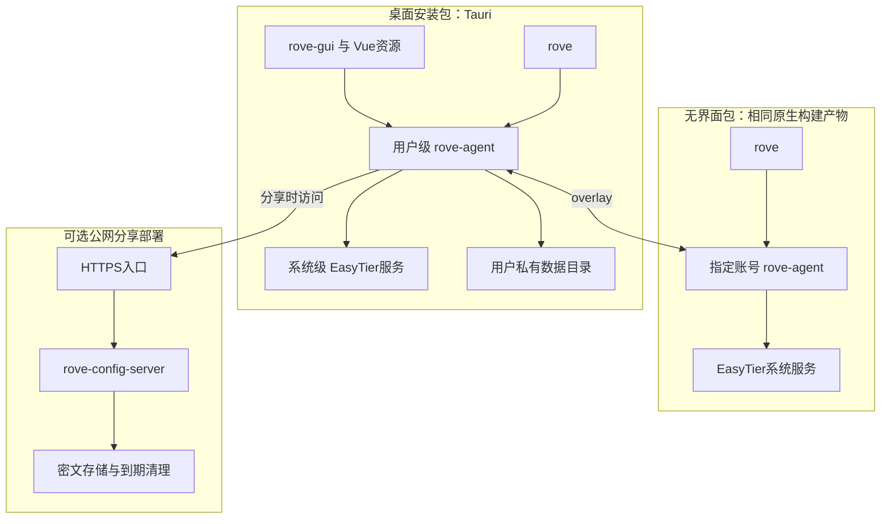
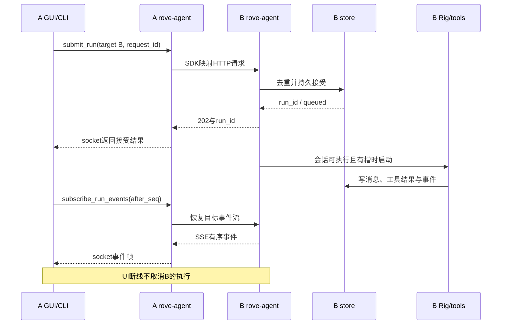
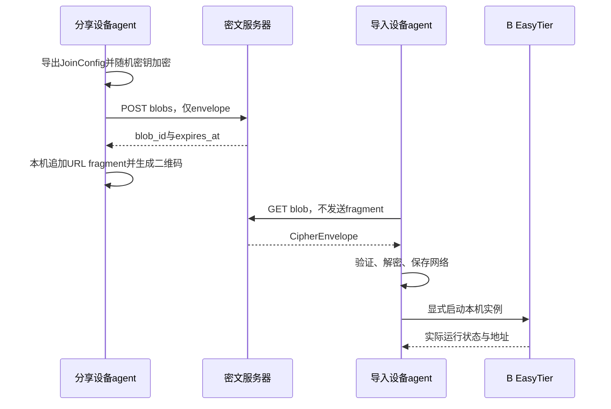
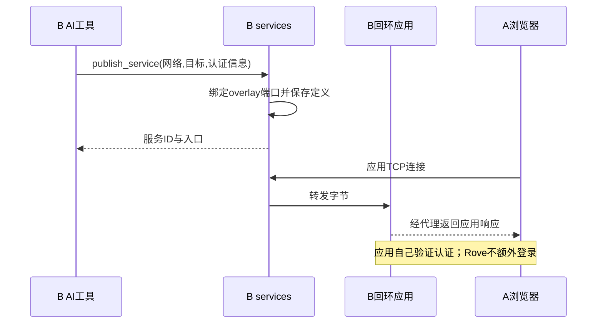

## Context

动机见 [proposal.md](proposal.md)。仓库当前只有 OpenSpec 配置和工作流文件，没有需要兼容的应用实现。行为契约见本变更的七份 `specs/*/spec.md`。

详细产品需求见 [requirements.md](requirements.md)，端到端体验见 [user-stories.md](user-stories.md)。接口以 [Agent OpenAPI](api/rove-agent.openapi.json) 和 [配置服务 OpenAPI](api/rove-config-server.openapi.json) 为准；本机 socket 映射见 [local-socket.md](api/local-socket.md)。本文件第12至17节补充架构视图、模块模型、进程模型、部署模型、数据与时序。

已确认的约束：设备对等；用户可以分享个人网络；网络成员完全信任；每台设备具有相同逻辑 agent；AI 决定装配步骤；GUI 与 CLI 仅为交互方式；网络安全交给 EasyTier。首版不能把目标设备固定为中心控制器，也不能将软件安装抽象成一套必须预先定义的产品操作。

## Goals / Non-Goals

**Goals:**

- 确立不循环依赖的 Rust 模块与进程边界，让本机、远端和移动端接入复用协议。
- 将持久状态归于执行设备，保证客户端切换和多会话并发时结果可追踪。
- 以少量通用工具、协议端点和本地数据结构完成桌面及无界面闭环。

**Non-Goals:**

- 无中心账号、Rove PKI、RBAC、网络审批、分布式数据库或全局调度服务。
- 不承诺任意并发 shell 操作的事务性、回滚或操作系统级 exactly-once。
- 不设计专用软件部署适配器目录、制品验签流水线或 AI 自动递归委派。
- 首版不承诺移动端离开应用后持续运行或完整 VPN 能力；共享核心保持可扩展。

## Decisions

### 1. Rust 命名与 workspace 边界

产品名为 Rove；Cargo package、目录与二进制使用 kebab-case，Rust crate/module/field 使用 snake_case，类型与 trait 使用 PascalCase，常量使用 SCREAMING_SNAKE_CASE。CLI 子命令和参数使用 kebab-case，JSON/TOML 字段使用 snake_case。GUI 二进制为 `rove-gui`，CLI 为 `rove`，避免仅靠大小写区别文件。

```text
Cargo.toml
crates/
  rove-core/          # 基础值类型、ID、配置与服务描述；无 IO
  rove-protocol/      # 请求、响应、事件、版本与错误契约
  rove-sdk/           # 本机 socket 和远端 overlay 客户端
  rove-agent/         # lib + bin；唯一 Rove 业务运行时
    src/api/
    src/ai/rig.rs
    src/overlay/easytier.rs
    src/tools/
    src/sessions/
    src/services/
    src/store/
    src/runtime.rs
apps/
  rove-cli/           # bin: rove
  rove-gui/           # Tauri Rust 壳 + Vue 3 / TypeScript / Vite
services/
  rove-config-server/ # 独立密文上传/下载服务
```

`rove-protocol -> rove-core`，`rove-sdk -> rove-protocol`；`rove-agent` 依赖 protocol 实现服务端，依赖 SDK 调用远端。GUI/CLI 消费 SDK；Vue 通过薄 Tauri bridge 进入 Rust SDK。SDK 不依赖 agent 实现。移动壳可额外依赖 agent library 来启动嵌入运行时，界面调用仍走 SDK 和本机协议。

备选：每个适配器独立 crate、SDK 直接引用 agent。前者在当前规模没有复用收益，后者产生循环依赖，因此保持适配器为 agent 内部模块。`rove-core` 和 `rove-protocol` 是基础模块，`rove-sdk` 是客户端 SDK；Rig 是 AI 库，EasyTier 配套程序是网络服务工具，均不作为 Rove SDK 的公共类型泄漏出去。

### 2. 一个 Rove 运行时，独立网络服务



桌面同一 OS 用户的同一数据目录只有一个 agent；以数据目录锁与 socket 就绪检查避免重复启动。CLI 与 GUI 连接已有实例，安装提供用户级 agent 服务；关闭界面不控制该服务的生命周期。Linux/macOS/Windows 各使用系统支持的服务管理方式。无界面部署使用选定账号；不同 OS 用户共享一个设备身份与实例暂不提供。

EasyTier 作为单独的系统服务安装，每台设备同时最多加入一个网络，Rove 只运行其对应实例；其本机管理端点不向 overlay 或物理网络暴露。agent 对接经过版本验证的本机管理 API；配套 `easytier-cli` 仅作内部管理/诊断工具，不作为面向用户的 Rove CLI 或 AI 工具。Rove 可保存多个个人网络配置，但保存不等于加入；切换须先停止当前网络，再启动另一个。地址由原版 EasyTier DHCP 分配，不指定网络级地址池，不维护底层补丁。Rove 保存期望网络配置，EasyTier 负责实际网络运行状态；避免双方各自接受另一套配置写入入口。

GUI 的打包携带程序和系统服务运行是两件事：安装时注册服务，运行时由服务管理器维护。Tauri 的 `externalBin` 支持随包携带按目标架构命名的程序，但不据此假设 GUI 退出后的服务生命周期。[Tauri 官方文档](https://v2.tauri.app/develop/sidecar/)

备选：将 EasyTier 直接嵌入所有 agent、让 GUI 长期持有全部后台子进程。独立服务便于处理网络系统权限，也使 CLI 和 GUI 使用同一后台；首版不承担网络内核嵌入适配工作。移动端仅将同一 agent library 嵌入应用，native 网络接入留在后续平台适配阶段。

### 3. 操作系统权限与完全信任网络

agent 使用当前用户或指定服务账号执行命令，命令工具继承该身份。需要系统提权时利用现有系统授权能力；后台无法交互则返回明确错误，不自动扩大账号权限。EasyTier 的网络系统权限与 agent 的命令执行权限分别由 OS 处理。本机 socket 仅允许对应账号访问。

远端 API 绑定 EasyTier 虚拟地址并约束来自对应 overlay 接口的入站访问；在支持弱主机网络模型的平台还需通过平台网络策略限制物理接口入站。仅绑定虚拟 IP 不是所有 OS 上完整的来源保证，必须通过物理 LAN 访问拒绝测试。无法建立此边界时不开放远端执行接口，也不回退到 `0.0.0.0`。

不引入 Rove 角色或令牌。当前网络成员能够操作该设备，不能承诺设备上保存的其他网络配置或用户文件对其保密。单网络加入限制不是设备内部权限隔离。默认目录查询按选定网络展示，这只是界面与路由语境。

备选：所有 agent 永久管理员运行、Rove 二次授权。前者改变默认 OS 执行上下文，后者违背已确认的完全信任网络模型，均不采用。

### 4. 身份和网络实例

| 字段 | 生命周期 | 用途 |
| --- | --- | --- |
| `device_id` | 首次初始化生成 UUID，保留数据时稳定 | 对等设备业务身份 |
| `network_id` | 创建网络时生成 UUID，随加入配置分享 | 跨设备网络归属 |
| `instance_id` | 本机网络实例 | EasyTier 管理适配器定位 |
| `peer_id` / `overlay_ip` | 随底层运行变化 | 当前路由缓存 |
| `session_id` / `run_id` / `service_id` | 创建记录时生成 UUID | 目标设备上的业务记录 |

设备 ID 明文保存在本地身份配置中，不是认证凭据。若选定 EasyTier 接口接受 `machine_id`，可以复用同一个值，但 Rove 不依赖此映射识别远端。导出配置不包含本机 instance、设备固定 IP、路径或其他主机专属字段。

发现流程：按网络从 EasyTier 查询候选 peer 地址，探测固定、可配置的 Rove 端口并调用 `hello`，校验版本和网络上下文后按 `device_id` 合并。本提案将默认 agent 端口具体化为43190，可在部署配置中统一覆盖；它不是注册服务端口，安装时需检查冲突。更改端口需要所有相关客户端采用匹配配置，首版不提供动态端口发现系统。普通 EasyTier 节点不会被误认为有 agent。已知设备可保留，在线状态和地址可按需刷新，不另建心跳服务。

备选：使用 hostname、peer ID 或 IP 作为主键。它们不能承担 Rove 所需的稳定业务关联，故只用于展示或当前访问。

### 5. 本机与远端统一语义

本机为 Unix domain socket / Windows named pipe，使用长度前缀 JSON 帧，请求与事件带关联 ID；远端为 `/v1` HTTP/JSON 加 SSE。两种 transport 消费同一 `rove-protocol`。本机流无需模拟 SSE，但提供相同有序事件。连接断开和作业生命周期解耦。

最小协议面包括 `hello`、网络及设备查询/配置、模型配置、session 创建/列表/历史、run 提交/查询/事件/取消、service 发布/查询/取消发布。远端请求携带显式网络和目标设备上下文；代理后的执行响应保留目标 `device_id`。只允许客户端显式选择的目标转发，不把 `peer_prompt` 注册为 AI 工具。

作业提交使用客户端生成的 `request_id`；目标在一个数据库事务中保存请求内容摘要、`run_id` 和 `queued` 状态后返回。重试同请求返回原作业，不同内容同 ID 返回冲突。SDK 只用原 ID 重试，不把不确定结果转换成全新提交。该机制保证 Rove 接受记录去重，不保证任意 shell 副作用 exactly-once。

事件使用 `(run_id, seq)`，先持久化再发送。重连提交最后序号，读取后续事件；若历史因输出上限截断，显式返回截断信息与快照。快照包括序号水位，客户端据此衔接实时流。握手支持协议范围和 capabilities；不同大版本不兼容时拒绝执行。

备选：GUI 直接操作 EasyTier、GUI/CLI 各自实现远端协议。它们会分散状态与错误处理，因此统一经本机 agent 和 SDK。

### 6. Rig 是每设备 AI 执行引擎

`ai::rig` 负责由设备配置创建模型客户端、加载会话上下文、驱动工具循环和转译流式事件；Rove 自己持久化失败、取消、中断和工具结果。默认模型配置包括 `provider`、`base_url`、`model`、`api_key`；首个适配路径选择经验证的兼容接口，其余提供方通过同一模块逐步接入，不承诺所有配置都具备相同工具调用行为。[Rig 官方文档入口](https://docs.rig.rs/)

模型配置属于设备，可由可信远端设置；不自动传播。运行开始时快照当前模型配置并记录非秘密模型标识；后续修改不改变已运行作业，排队作业在开始时使用届时配置。初始化不依赖 AI 可用，模型尚未配置也能管理网络和查看设备。

首版 AI 工具仅提供 `system_exec` 和 `publish_service`。命令输入保留命令、工作目录和必要执行参数；返回退出码、stdout/stderr、超时与取消信息。未来 `native_*` 保留模块接入位置，但不预设插件市场或部署产品目录。

备选：用 Rig 的内部对象直接作为数据库模型，或给每种软件建立部署动作。前者绑死引擎实现，后者违背 AI 装配原则，均不采用。

### 7. 同会话串行，跨会话有界并行

每个 session 有 FIFO 待执行列表，每设备 `max_active_runs = 4`，配置必须为正整数。调度器只选择没有活动 run 的 session 队首作业，再占用设备运行槽；同 session 等待项不会先占槽而堵塞其他 session。不同 session 按最早可执行提交顺序选取，避免反复轮询与隐藏优先级。调低并发值不取消现有 run。

排队消息先存在 run 的输入记录中，只有轮到该 run 开始时才追加到会话执行历史。后续排队输入不得进入当前运行的模型上下文；成功、失败、取消的实际输出都属于已发生历史。取消中的 run 仍占用其会话与设备槽，直至受管理执行结束或明确记录终止结果。

单 run 的模型/工具循环有序执行，包括模型一次返回多个工具调用的情况。不同 run 的 `system_exec` 可以并发，没有全设备命令锁。SQLite 事务、端口分配等短临界区各自保护，但不在模型或进程等待期间持有全局锁。



取消令牌传播到模型请求与本作业受管理子进程；其他 run 不受影响。取消不回滚已完成安装或停止刻意部署的独立服务；无法终止的子进程如实记录。重启先将旧未完成记录归为 `interrupted`，不恢复执行旧队列。必要的输出、命令时间和排队容量上限属于资源保护配置，超限行为必须明确可见，不能让后台无限积累请求。

备选：全设备单作业已被用户否决；同 session 完全并行需要上下文分支与合并，因此不采用。多个 run 并发修改同一文件等业务冲突无法靠通用命令执行器可靠推断，首版诚实返回实际结果。

### 8. 小型本地存储

本机 SQLite 保存网络期望配置、模型配置、sessions/messages、runs/events、服务定义和已知设备；设备 ID 存在身份配置中。数据库写入由 agent 统一执行，GUI/CLI 不直接打开数据库。时间较长的 AI 和系统命令不持有数据库事务。

网络实际状态由 EasyTier 查询返回，不能以保存的期望配置冒充已运行状态。服务目录归提供设备所有，其他设备按需查询并可缓存；没有中心目录与分布式同步协议。持有 API 密钥的本机文件使用 OS 账号文件保护，常规日志与状态 API 脱敏；不宣称能向已获设备控制权的网络成员隐藏本机凭据。

备选：共享网络数据库、客户端直接写配置文件。前者引入协调成本，后者破坏唯一运行时归属，因此不采用。

### 9. 网络分享的密文服务

`network_join_config` 包含 `schema_version`、`network_id`、显示名及可移植 EasyTier 字段。导入先下载、认证解密、验证格式和本机适配，再持久化。重复相同网络返回已有记录；同 ID 不同配置报冲突，显式更新才覆盖。

采用成熟实现的 AES-256-GCM：每次分享生成新的 256-bit 随机密钥和 96-bit nonce，以版本化 envelope 保存算法、nonce 和密文；固定 AAD 为 UTF-8 `rove.network_join_config.v1`，未知版本或算法在解密前拒绝。密文拼接16字节 tag后用无 padding base64url编码。密钥只进入 URL fragment，示意为 `https://<config-host>/c/<blob_id>#key=<base64url-key>`。Rove 解析 URL，在本机解密；公网网页不作为可信解密执行入口。

密文服务提供上传、按随机 ID 下载和到期清理，默认保存七天；无账号、设备表和邀请审批。服务器可保存密文、格式元数据和到期时间。上传体积、存储容量及请求频率设置普通服务上限，防止公开匿名端点耗尽存储，不增加成员权限模型。

二维码直接编码 URL；手动入口接受相同逻辑网络参数并走同一验证器，不依赖公网下载。URL 导入和扫码分享依赖密文服务器，组网后日常操作不依赖它。链接到期既不回收已下载配置，也不撤销成员；网络凭据变更仍由 EasyTier 管理。

备选：公网服务持有解密密钥、扫码触发审批、网络包携带模型配置。这些均偏离已确认的轻量分享方式。

### 10. 服务代理和服务登记

`publish_service` 保存 `(network_id, device_id, service_id)`、名称、回环目标、监听端口、应用协议提示与不透明 `access_info`。agent 建立指定 overlay 地址到 `127.0.0.1:<target_port>` 的 TCP 转发，首版也可接受明确的 IPv6 loopback；不允许发布目标偷偷变成任意公网代理。监听端口首次分配后保存，重启优先恢复原端口；端口被占时报告恢复失败，由用户更新发布配置，避免静默改变第三方客户端地址。

代理建立后才登记为已发布；数据库保存失败则释放监听资源。网络停止时关闭对应入口，配置保留；网络或 agent 恢复时重建。地址变化更新服务 URL，已配置旧 IP 的第三方应用可能需要重新取得地址，首版不提供稳定域名保证。

HTTP/HTTPS 仅表示目标应用协议，Rove 不做 TLS 终止、路径重写或统一登录。纯 TCP 转发可传输应用字节，但应用自己的证书、重定向和外部地址配置仍可能影响浏览器使用。取消发布关闭代理与活动记录，不卸载目标应用。

备选：只登记 URL、单独反向代理服务。前者不满足本机服务代理需求，后者增加首版常驻进程，故由 agent 承担轻量 TCP 转发。

### 11. 界面、打包和交付顺序

Vue 界面围绕网络、设备、会话/作业和服务展开，模型配置与并发设置属于设备设置。CLI 提供 `rove` 交互入口，以及 `network`、`device`、`model`、`session`、`run`、`service`、`config`、`agent` 等 kebab-case 子命令组。查询支持 `--json`，诊断走 stderr；交互式秘密输入避免默认回显。GUI 操作验收矩阵逐项对应 CLI 能力，扫码对应 URL 输入，打开浏览器对应输出地址。

桌面以 Tauri 打包 GUI 与配套原生程序，按系统/架构组装并注册 agent 与 EasyTier 服务。无界面包复用同一批编译产物，省略 GUI，提供 CLI 与服务安装资源；Tauri GUI 打包本身不作为无界面运行的前置条件。完整支持矩阵在实际构建时按验证结果标记，目标包含 Linux、Windows、macOS 的可支持架构；Android/iOS 首版为明确标识能力边界的移动壳。

先完成无界面两设备的组网→AI→服务访问闭环，再完成 Vue 流程和平台安装验证。移动端 native VPN、后台生命周期和工具插件作为后续能力交付；此提案不将一个可编译移动壳称为完整移动漫游实现。

### 12. 系统架构视图与控制/数据路径



控制路径是用户→本机 agent→目标 agent；目标 agent 使用 Rig 组织模型调用和本机工具。模型服务不是 Rove控制中心，本机模型和云模型均只是配置的推理端点。服务数据路径为浏览器/原生应用经 overlay直接访问发布端口，不经过 GUI或模型。EasyTier提供底层数据传输，图中的远端 API边同样承载于该 overlay。

配置服务器仅参与分享。断开配置服务不影响已加入网络的控制和服务数据路径。网络中所有 Rove设备都可承担图中的 A或 B身份，界面选择改变本次执行位置，不改变设备角色。

### 13. 模块模型与接口所有权

| 模块 | 负责 | 输入/输出 | 所有权边界 |
| --- | --- | --- | --- |
| rove-core | ID、值对象、领域状态 | 纯值与校验结果 | 无网络、数据库、Rig、Tauri依赖 |
| rove-protocol | OpenAPI 对应 DTO与事件 | 请求/响应/schema | 不包含服务端和调度实现 |
| rove-sdk | 本机/远端客户端、版本核对、重连 | typed operation / typed result | 不直接写应用状态，不依赖 agent |
| agent::api | socket与HTTP入口、参数校验、目标校验 | 协议 DTO到领域调用 | 不执行持久耗时 AI循环 |
| agent::runtime | 初始化、生命周期、模块组装 | 平台环境与本机配置 | 一个数据目录一个拥有者 |
| agent::overlay | EasyTier配置映射、实例操作、路由快照 | 期望配置/实际状态 | 不重写底层路由和密码协议 |
| agent::ai | 模型配置快照、Rig适配、工具循环 | 会话历史/RunEvent | 不把 Rig对象作为持久协议 |
| agent::sessions | 会话、去重、FIFO与并发槽、取消 | RunSubmit/Run状态 | 模型等待不持有全局锁 |
| agent::tools | system_exec与publish_service桥接 | ToolCall/ToolResult | 工具数量精简，无产品安装动作表 |
| agent::services | 服务定义、监听端口、TCP转发 | ServiceWrite/Service | 控制入口寿命，不控制目标应用寿命 |
| agent::store | 事务、消息、事件和状态持久化 | 领域记录 | 所有写操作来自本机 agent |
| rove-cli | 交互、子命令、输出与退出码 | SDK方法 | 不复制业务决策 |
| rove-gui | Vue展示、Tauri桥接、系统交互 | SDK方法/事件 | 不直接控制网络后台 |
| rove-config-server | 匿名密文暂存、到期清理 | CipherEnvelope/Blob | 不存网络成员、模型或解密密钥 |

对外接口先在 OpenAPI变更，再更新 rove-protocol、SDK和实现。可以生成 DTO，也可以手写并以契约测试约束；禁止因为选定生成器不支持某特性就默默改变公开语义。

### 14. 进程模型与启动顺序

| 进程/运行单元 | 数量与寿命 | 拉起者 | 终止影响 |
| --- | --- | --- | --- |
| rove-gui | 用户按需启动 | 用户/桌面 | 桌面界面断开，不终止后台 |
| rove | 每次CLI调用或交互会话 | 用户/脚本 | 连接断开，不取消已接受 run |
| rove-agent | 同一账号数据目录一个常驻实例 | OS用户服务或指定服务账号 | 进行中 run中断；本机代理停止 |
| easytier-core | 本机独立网络服务，Rove 同时最多运行一个网络实例 | OS系统服务 | overlay中断；agent仍能本机查询与执行 |
| easytier-cli | 按需短进程 | 安装/诊断适配器 | 不拥有网络生命周期 |
| AI命令子进程 | 每个工具调用按需，跨run可并发 | 目标agent | 结果归对应run；不影响无关run |
| 已部署应用 | 由其安装方式管理 | OS服务/容器/应用启动方式 | 独立于GUI与AI对话寿命 |
| 配置服务器 | 一个部署实例或普通副本 | 独立服务器服务管理器 | 影响新分享/下载，不影响已有网络 |
| 移动agent核心 | 一个嵌入运行时 | Tauri移动壳 | 受应用与OS生命周期约束 |

桌面启动顺序：OS启动 EasyTier服务；用户服务启动 agent；agent锁定数据目录、初始化存储、将旧 run标记中断、打开本机 socket；连接底层网络服务并恢复 enabled网络；有有效 overlay地址后开放远程接口和恢复代理。网络未就绪时本机设置与查询可用，返回明确的实际状态。

服务关闭时先停止接收新的作业与订阅，再终止受管理执行并保存状态，关闭代理、释放数据目录锁。突然崩溃由下次启动处理未完成记录。网络服务崩溃只使远程连接和代理不可用，不把 agent的本机 AI任务自动取消。

### 15. 数据模型与事务边界



该图描述跨设备逻辑关系，不表示共享数据库。每设备仅写自己的 records；远端 device和路由是缓存，远端 session和service按需查询。

| 记录 | 主键/唯一条件 | 关键内容 | 持久化策略 |
| --- | --- | --- | --- |
| identity | 单份 device_id | 安装身份 | 首次生成，更新复用 |
| networks | network_id；本机 instance_id唯一 | 入网配置、显示名、enabled | 本机期望状态；实际状态从底层查询 |
| known_devices | network_id + device_id | 名称、平台、最后路由、last_seen | 允许过期的缓存，不作在线证明 |
| model_config | 本机单份 | provider/base_url/model/secret | OS文件保护；公开读脱敏 |
| sessions | session_id | 标题、设备、创建/更新时间 | 目标设备保存 |
| runs | run_id；request_id设备内唯一 | session、输入摘要、原始输入、状态、模型快照 | 接受事务保存；启动和终态事务推进 |
| messages | message_id；session内有序 | role、parts、run_id | 已发生上下文；排队未来输入未进入 |
| run_events | run_id + seq | kind、data、时间 | 先保存后发送；有界保留 |
| services | service_id | network、target、port、access_info | 定义与运行状态分开 |
| blobs（独立服务） | 随机 blob_id | envelope、created_at、expires_at | 七天到期后清理 |

事务 T1：去重查找→验证可接受→保存 run与接受信息，成功提交后返回202。事务 T2：锁定会话队首并设置 running、模型快照、首条输入；原子并发槽在内存调度中对应这个状态。事务 T3：保存消息/工具结果和事件，提交后广播。终态与释放槽之间需避免重复调度，运行时重启通过数据库记录重建中断结果。

网络与 TCP监听是外部资源，不能假装和 SQLite组成分布式事务。网络变更保存期望并记录实际失败；发布服务先预留监听再持久化，失败释放；更新服务失败保留旧定义。显式删除网络须已停止，删除本机相关发布定义与路由缓存，保留会话和已部署软件。

### 16. 部署模型



| 部署类型 | 组成 | 状态位置 | 运行要求 |
| --- | --- | --- | --- |
| Linux桌面 | Tauri GUI、CLI、agent、网络程序与服务资源 | 用户数据目录 | 桌面会话和系统网络服务 |
| Windows桌面 | GUI、CLI、agent、网络程序、安装服务资源 | 当前用户应用数据目录 | named pipe与匹配架构网络驱动/程序 |
| macOS桌面 | 应用bundle、CLI入口、用户agent、网络服务 | 用户应用支持目录 | 平台系统授权与匹配架构产物 |
| 无界面 | CLI、agent、网络程序 | 指定服务账号数据目录 | 不要求 WebView或图形会话 |
| Android/iOS首版壳 | Tauri/Vue、嵌入核心 | 应用私有存储 | 标注未交付 native网络和后台能力 |
| 密文服务 | 服务程序/容器、HTTPS反代、持久存储 | 服务端专用数据卷 | 配置公开根URL、容量、七天保留与清理 |

同一源码构建不同系统与架构的发行物；Tauri externalBin按target triple匹配。无界面包复用同一批原生二进制，避免因没有GUI而缺少CLI。安装器承担服务注册与必要系统授权；GUI不保存管理员密码来维持后台网络。

模型配置、入网密钥与应用认证信息位于本机数据目录，分享服务器只有密文。部署参数区分业务设置（OpenAPI Settings）、本机引导（数据目录、socket、agent端口、服务账号、EasyTier管理端点）和配置服务参数（监听、公开URL、存储路径）。后两类属于启动参数/配置文件，由 CLI/安装器处理，不增加远程更改运行账号的管理接口。

升级顺序为备份数据→停止Rove自有后台→替换匹配产物→迁移数据库→启动并检查socket/网络/代理。数据库版本不匹配时不能直接旧版本覆盖运行。卸载默认保留数据，已部署第三方应用由用户单独管理。

### 17. 关键业务时序







停止网络会断开依赖该网络的远端API和服务连接，但已接受AI作业仍在本机推进；重新启动后客户端查询已有run而非重新提交。代理恢复、模型调用失败与底层网络失败分别记录，不归为一个含糊的“设备失败”。

## Risks / Trade-offs

- [上游 API 和目标架构差异] → 实施第一阶段固定 Rig/EasyTier/Tauri 版本，验证多实例本机管理、流式工具循环与目标构建；用私有适配器隔离上游类型。EasyTier 以官方发行及源代码验证为准，不将前期讨论的内部 API 名称视为已验证事实。[EasyTier 官方仓库](https://github.com/EasyTier/EasyTier)
- [网络切换与地址变化] → 每设备同时最多加入一个网络；停止旧实例并撤销旧入口后才能启动另一个。地址从 EasyTier 实际状态获取，仍检查与物理网络的冲突和入站边界，不要求独立个人网络之间地址互斥。
- [并发命令竞争共享文件、包管理器和端口] → 保留独立作业输出与错误，不添加全设备命令锁，也不承诺自动事务回滚。
- [设备睡眠或离线] → 会话留在目标设备，远端显示不可达；代理访问同样依赖提供设备在线。
- [公开密文服务不可达或过期] → 已加入设备照常运行，手动入网可用；重新分享需再次成功上传。
- [特权网络服务安装或系统授权失败] → 安装与运行结果如实反馈；不能以启动 GUI 成功代替网络服务验证。
- [默认并发四个导致提供方限流或资源竞争] → 用户可调整并发和工具资源上限；提供方错误保留到各自作业。

## Migration Plan

全新应用，无既有用户数据迁移。实现阶段引入带版本的数据库初始化与向前迁移；每次升级迁移前备份本机数据，优先支持向前升级。回退到旧二进制前停止当前服务并恢复匹配的数据备份，不直接用旧程序打开未知的新 schema。

桌面安装首先放置架构匹配的程序，再注册系统网络服务与用户 agent，最后验证本机 socket 与网络健康。更新只停止和替换 Rove 自有程序，不自动删除 AI 已部署的应用或用户数据。卸载默认保留数据，显式清理另行执行。

提案验收以协议契约测试、真实两设备网络测试及各声明平台安装记录为依据；模型单元测试使用可控假提供方，真实模型验证单独记录，不要求每次测试调用收费服务。
